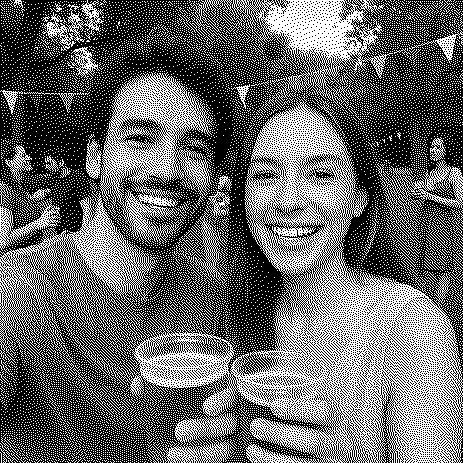

# Ditherbooth

[](https://github.com/AlexNly/ditherbooth/actions/workflows/tests.yml)
[](https://codecov.io/gh/AlexNly/ditherbooth)
[](https://www.python.org/)
[](https://github.com/psf/black)
[](LICENSE)
[](https://fastapi.tiangolo.com/)

Ditherbooth is a small FastAPI service and single-page app for printing photos to a Zebra LP2844 label printer.  Images are uploaded through the web UI, converted to 1‑bit dithered bitmaps with Pillow, encoded as EPL2 or ZPL graphics commands, and spooled to CUPS as raw jobs.

## Prerequisites

* Python 3.9+
* [CUPS](https://www.cups.org/) with a **raw** queue named `zebra2844`
* Zebra LP2844 or LP2844‑Z printer connected via USB
* `DITHERBOOTH_PRINTER` environment variable (optional) to override the CUPS queue name; defaults to `zebra2844`

### Create a raw queue
Plug the printer in and register it with CUPS.  Both Raspberry Pi OS and macOS ship with CUPS.

```bash
sudo lpadmin -p zebra2844 -E -v usb://Zebra/LP2844 -m raw
```

You can verify the queue with:

```bash
lpstat -p zebra2844
```

### Smoke‑test the printer
Print a simple "Hello" label to confirm the queue works before using the app:

```bash
python - <<'PY'
from printer.cups import spool_raw
payload = (
    'N\nq400\nQ200,24\nA50,50,0,3,1,1,N,"Hello"\nP1\n'
)
spool_raw('zebra2844', payload)
PY
```

The printer should output a small label containing the word *Hello*.

## Installation

```bash
python3 -m venv venv
source venv/bin/activate
pip install -r requirements.txt
```

## Development server

Start the API and static frontend:

```bash
make dev
```

Visit [http://localhost:8000](http://localhost:8000) and upload or capture a photo.  Choose media width and printer language and press **Print** to send the job to the printer.

### Access on your network (phone/tablet)

Run the dev server bound to your LAN IP:

```bash
make dev HOST=0.0.0.0 PORT=8000
```

Find your IP (examples):

- macOS: `ipconfig getifaddr en0`
- Linux: `hostname -I`

Then open `http://<your-ip>:8000` on your phone (same Wi‑Fi). Use the gear icon (Dev Settings) to enable Test Mode so no printer is required.

### Developer settings and test mode

The app exposes a small password-protected settings API to make the frontend configurable without exposing options to end users. These settings are persisted to a JSON file (`ditherbooth_config.json` by default) and are used both by the UI and the print endpoint.

- `DITHERBOOTH_DEV_PASSWORD`: Password required for the settings API (default: `dev` for local/testing). Set this in production.
- `DITHERBOOTH_CONFIG_PATH`: Optional path to the settings JSON file. Useful in tests or deployments.

Endpoints:

- `GET /api/public-config`: Public, returns defaults and whether to lock controls in the UI.
- `GET /api/dev/settings`: Requires header `X-Dev-Password`. Returns full config.
- `PUT /api/dev/settings`: Requires header `X-Dev-Password`. Accepts JSON fields:
  - `test_mode` (bool) — if true, the `/print` endpoint will process the image but skip spooling to the printer and return `{status:"ok", mode:"test"}`.
  - `default_media` (string: one of `continuous58`, `continuous80`, `label100x150`)
  - `default_lang` (string: `EPL` or `ZPL`)
  - `lock_controls` (bool) — hides media/language selectors in the UI for kiosk usage.
  - `printer_name` (string, optional) — override the printer queue name used by the backend (otherwise falls back to `DITHERBOOTH_PRINTER` env, then `zebra2844`).

The redesigned frontend includes a settings modal (gear icon) where an admin can enter the dev password to view and update the settings. Regular users won’t see or need to touch configuration; if `lock_controls` is enabled, the media/language selectors are hidden and the UI presents a simple “choose image → print” flow.

## API test with cURL

You can send an image directly to the `/print` endpoint without the UI:

```bash
curl -F "file=@path/to/image.jpg" \
     -F media=continuous58 \
     -F lang=EPL \
     http://localhost:8000/print
```

A JSON response of `{ "status": "ok" }` indicates the job was submitted.

If test mode is enabled via settings, the response will include `{ "status": "ok", "mode": "test", ... }` and no job is sent to the printer.

## Media presets

Available media widths (dots):

- `continuous58` → 463
- `continuous80` → 640 (default)
- `label100x150` → 799

You can change the default in the Dev Settings modal, or via the API.

## Image processing script

- `notebooks/image_processing.py` (uses `# %%` cells)

Run end-to-end (auto-picks an image in `notebooks/` if available):

```bash
python notebooks/image_processing.py
```

Examples:

```bash
# Use a specific image in notebooks/
python notebooks/image_processing.py -i notebooks/your_image.png

# Change printer width (dots)
python notebooks/image_processing.py -i notebooks/your_image.png -w 463

# Choose a custom output directory
python notebooks/image_processing.py -i notebooks/your_image.png --out notebooks/out_custom
```

You can also open the script in VS Code/Jupyter and run the `# %%` cells interactively.

## Examples

The images below are produced with the exact pipeline used for printing: the helper `imaging.process.to_1bit` (same code path FastAPI calls before encoding to EPL/ZPL). Width is set to `463` dots (media `continuous58`).

Generate the outputs locally:

```bash
python notebooks/image_processing.py -i notebooks/20250902_0027_PartyinthePark_example.png -w 463
```

Result files are written to `notebooks/out/`.

Original (left) and final 1‑bit (right):

<p>
  
  
</p>

Optional intermediate views used for illustration (not sent to the printer):

<p>
  
  
</p>

## Formatting and linting

Format the code with:

```bash
make format
```

## Compiling

Check that the Python sources are syntactically valid:

```bash
python -m py_compile app.py imaging/process.py printer/cups.py printer/epl.py printer/zpl.py
```

## Notes

Camera capture in the browser requires HTTPS on non‑localhost hosts.  When deploying on a LAN, run the service behind a self‑signed certificate or a local CA such as `mkcert`.

### Code coverage (Codecov)

This repository publishes test coverage to Codecov via GitHub Actions. The workflow runs `pytest --cov=. --cov-report=xml` and uploads `coverage.xml`.

- Public repo: no token required.
- Private repo: set `CODECOV_TOKEN` in repository secrets if needed.

## License

This project is licensed under the MIT License — see the [LICENSE](LICENSE) file for details.
