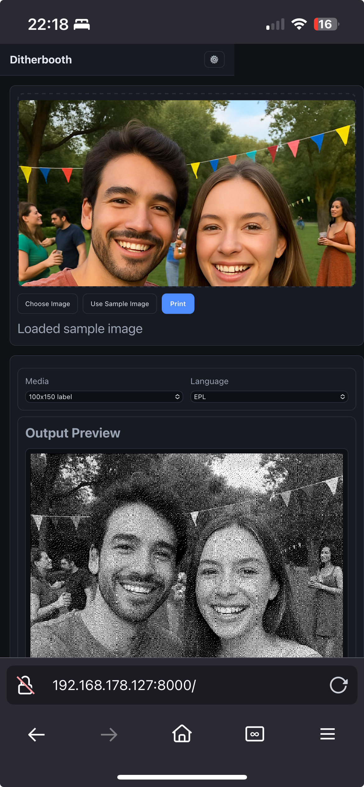
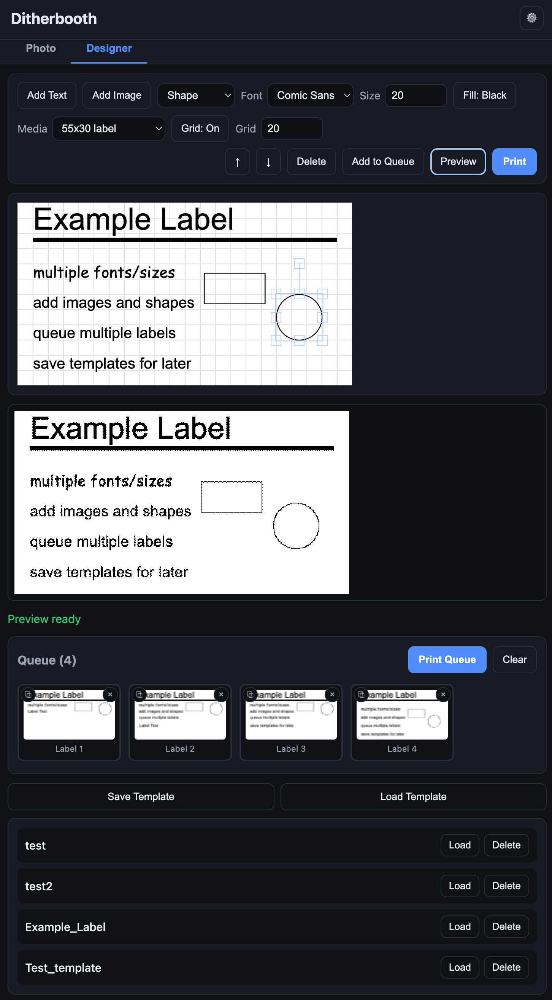

# Ditherbooth

[](https://github.com/AlexNly/ditherbooth/actions/workflows/tests.yml)
[](https://codecov.io/gh/AlexNly/ditherbooth)
[](https://www.python.org/)
[](https://github.com/psf/black)
[](LICENSE)
[](https://fastapi.tiangolo.com/)

A free, browser-based photo booth and label designer for any EPL/ZPL thermal printer.

<p align="center">
  
  
</p>

## What is this?

Ditherbooth turns any phone or computer into a photo booth for thermal label printers. Upload or snap a photo, and it gets converted to a crisp 1-bit dithered bitmap and printed instantly. It also includes a full label designer for creating custom labels with text, images, and shapes. Works with any EPL2 or ZPL compatible printer — Zebra LP2844, GK420d, ZD220, and many others.

## Screenshots

<p align="center">
  
  
</p>
<p align="center"><em>Snap a photo and print it instantly (left) — design custom labels with templates and queue (right)</em></p>

## Features

**Photo booth**
- Upload or capture photos from any device
- Floyd-Steinberg dithering to 1-bit black & white
- Live preview before printing
- Multiple media sizes (continuous rolls and fixed labels)

**Label designer**
- Fabric.js canvas editor with text, images, and shapes
- Font picker, fill toggle, object layering
- Smart snapping guides (PowerPoint-style)
- Save and load templates
- Multi-label print queue with drag-to-reorder

**Printer support**
- EPL2 and ZPL encoding
- Prints via CUPS — works on macOS and Linux
- Compatible with any EPL/ZPL thermal printer
- Test mode for development without a printer
- Kiosk mode to lock down the UI

## Quick Start

### Prerequisites

- Python 3.9+
- [CUPS](https://www.cups.org/) with a configured printer queue
- Any EPL2/ZPL thermal printer connected via USB

### Set up your printer

**macOS** (no raw queue support — use the EPL2 driver):

```bash
lpinfo -v | grep -i zebra   # Find your printer's USB device

sudo lpadmin -p Zebra_LP2844 -E \
  -v "usb://Zebra/LP2844?serial=YOUR_SERIAL_NUMBER" \
  -m drv:///sample.drv/zebraep2.ppd

cupsenable Zebra_LP2844
cupsaccept Zebra_LP2844
```

**Linux:**

```bash
sudo lpadmin -p Zebra_LP2844 -E -v usb://Zebra/LP2844 -m raw
```

### Install and run

```bash
python3 -m venv venv
source venv/bin/activate
pip install -r requirements.txt
make dev
```

Open [http://localhost:8000](http://localhost:8000) and print something.

### Access from your phone

```bash
make dev HOST=0.0.0.0
```

Then open `http://<your-ip>:8000` on your phone (`ipconfig getifaddr en0` on macOS, `hostname -I` on Linux).

### No printer? No problem

Enable test mode via the gear icon in the UI (password: `dev`), or:

```bash
curl -X PUT -H "X-Dev-Password: dev" -H "Content-Type: application/json" \
  -d '{"test_mode": true}' http://localhost:8000/api/dev/settings
```

## Configuration

Settings are persisted to a JSON config file and accessible via a password-protected API.

| Setting | Type | Description |
|---------|------|-------------|
| `test_mode` | bool | Process images without printing |
| `default_media` | string | Default media preset |
| `default_lang` | string | `EPL` or `ZPL` |
| `lock_controls` | bool | Hide selectors for kiosk mode |
| `printer_name` | string | Override CUPS queue name |
| `epl_darkness` | int (0-15) | EPL darkness setting |
| `epl_speed` | int (1-6) | EPL speed setting |

**Environment variables:**

| Variable | Default | Description |
|----------|---------|-------------|
| `DITHERBOOTH_PRINTER` | `Zebra_LP2844` | CUPS queue name |
| `DITHERBOOTH_DEV_PASSWORD` | `dev` | Password for settings API |
| `DITHERBOOTH_CONFIG_PATH` | `~/.config/ditherbooth/config.json` | Config file location |

**API endpoints:**

- `GET /api/public-config` — public config (media dimensions, defaults)
- `GET /api/dev/settings` — full config (requires `X-Dev-Password` header)
- `PUT /api/dev/settings` — update config (requires `X-Dev-Password` header)

## API

```bash
# Print an image
curl -F "file=@photo.jpg" -F media=continuous58 -F lang=EPL http://localhost:8000/print

# Preview (returns dithered PNG)
curl -F "file=@photo.jpg" -F media=continuous58 http://localhost:8000/preview -o preview.png
```

## Media presets

| Preset | Width (dots) | Height | Type |
|--------|-------------|--------|------|
| `continuous58` | 463 | auto | Continuous roll |
| `continuous80` | 640 | auto | Continuous roll (default) |
| `label100x150` | 800 | 1200 | Fixed label |
| `label55x30` | 440 | 240 | Fixed label |
| `label50x30` | 400 | 240 | Fixed label |

## Development

```bash
pip install -r requirements-dev.txt
make format   # Black formatter
pytest         # Run tests
```

Camera capture requires HTTPS on non-localhost hosts. For LAN use, run behind a self-signed cert or [mkcert](https://github.com/FiloSottile/mkcert).

## Troubleshooting

See [docs/troubleshooting.md](docs/troubleshooting.md) for printer setup issues, stuck jobs, and common errors.

## Contributing

Pull requests welcome. Please open an issue for major changes and ensure tests pass before submitting.

```bash
make format
pytest
```

## License

MIT — see [LICENSE](LICENSE).
